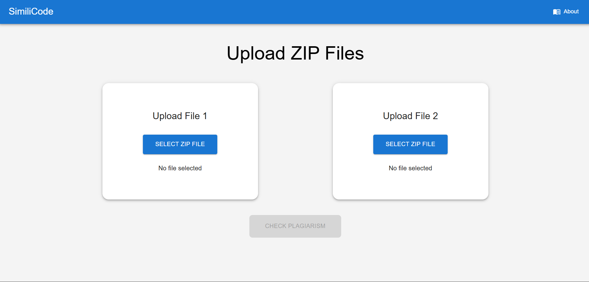
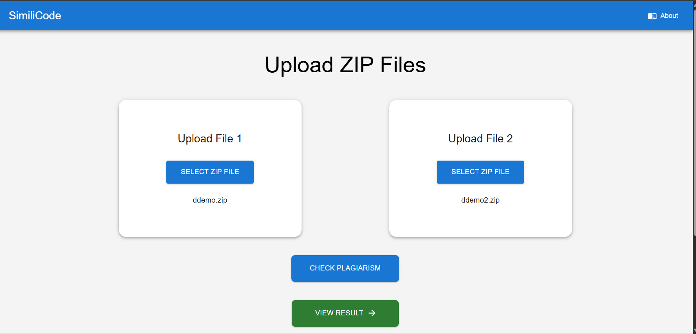
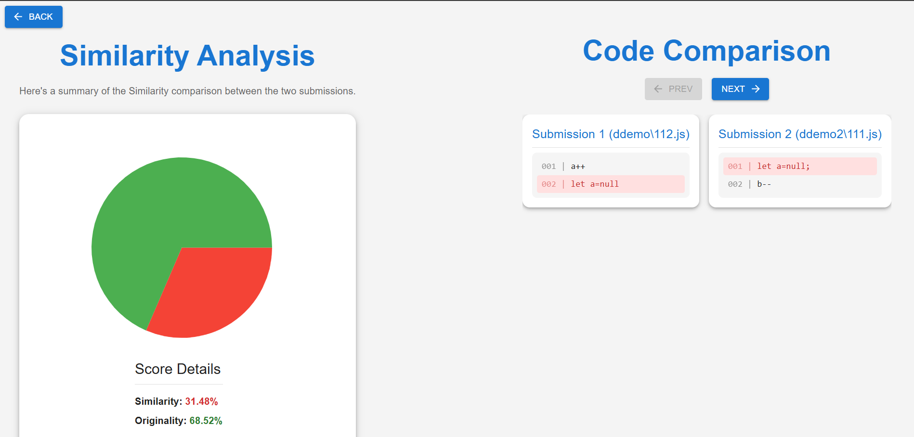
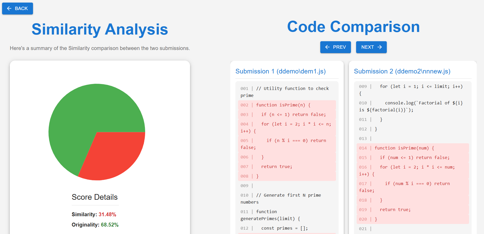
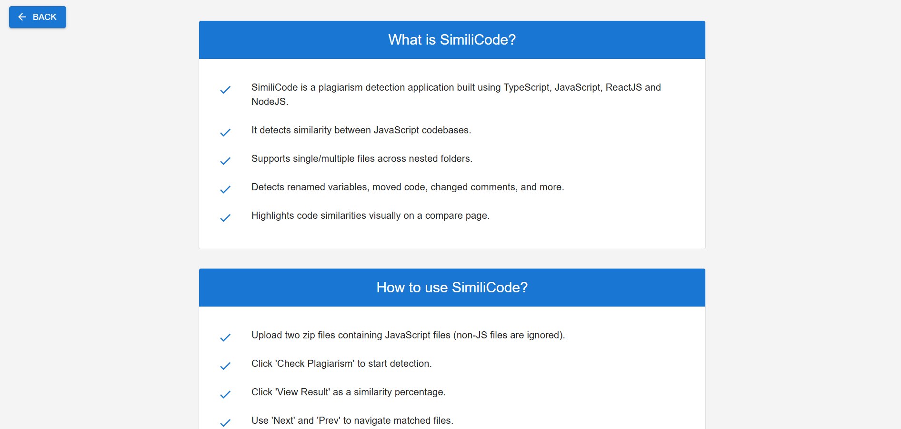

# 🧠 SimiliCode

**SimiliCode** is a robust and intelligent plagiarism detection application designed specifically for **JavaScript** codebases. It performs deep structural analysis using **Abstract Syntax Trees (ASTs)** to detect code similarities even when variable names are changed, comments are modified, or code blocks are rearranged.

---
## 🚀 Live Demo

You can try out a live version of the application here:

[**Try SimiliCode Live!**](https://jade-mooncake-3dc735.netlify.app/)

---

## 🚀 Features

- 🔍 **AST-Based Comparison**  
  Compares JavaScript code structurally using ASTs to detect logic-level similarities.

- 🗂️ **Multi-File & Nested Folder Support**  
  Upload zipped directories; the system recursively reads JavaScript files from subfolders.

- ✏️ **Smart Matching**  
  Handles renamed variables, reordered functions, added/removed comments, and more.

- 🎨 **Visual Code Diff Viewer**  
  Highlights matching code snippets directly in the UI for easy comparison.

- 📊 **Plagiarism Score**  
  Returns a percentage score indicating how similar the two codebases are.

---

## 📸 How to Use

1. **Upload Submissions**  
   Upload **two `.zip` files**, each containing one set of JavaScript files.  
   *(Note: Non-JavaScript files will be ignored)*

2. **Detect Plagiarism**  
   Click **"Check Plagiarism"** to run the detection algorithm.

3. **View Result**  
   A similarity score (in %) is shown on the result page.

4. **Compare Files**  
   Use **"Next"** and **"Prev"** buttons to navigate through matched file pairs.  
   Red highlights indicate matching code segments.

---

## 📸 Screenshot

## ⚙️ How It Works

- Converts each `.js` file in both submissions to an **Abstract Syntax Tree** (AST)
- Compares AST node sequences and their structure to compute similarity
- Detects:
  - Renamed variables/functions
  - Comment edits/additions
  - Reordered or wrapped code blocks
- Computes a **similarity percentage**
- Highlights matching code blocks on the compare screen

---

## 🧱 Tech Stack

| Layer        | Technology                            |
|--------------|---------------------------------------|
| Frontend     | React.js, JavaScript, MUI             |
| Backend      | Node.js, Express, Typescript          |
| AST Parsing  | Babel                                 |
| File Upload  | Formidable                            |

## 🚀 Getting Started

### 1. Clone the repository
<pre>
git clone https://github.com/anuragk-04/SimiliCode.git
cd similicode </pre>

### 2. Start Frontend
<pre>
cd frontend
npm install
npm run dev
</pre>

### 3. Start Backend
<pre>
cd server
npm install
npm start 
 </pre>

## 🚈 Future Improvements

- [ ] Support for multiple languages like Python, C++, etc.
- [ ] Export similarity reports as downloadable PDFs
- [ ] GitHub repo link checker and plagiarism from public repos

